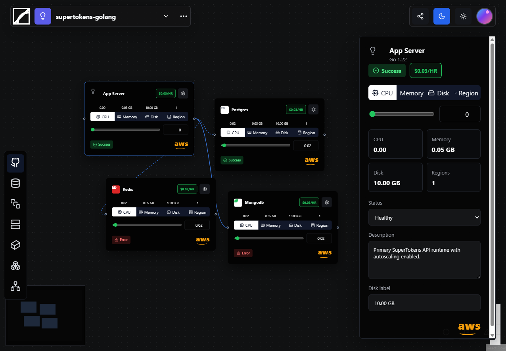

# ReactFlow Cloud Canvas

Frontend Intern Task implementation matching the provided dark ReactFlow canvas reference.

## Live Demo

🔗 https://ainyx-app-graph-builder.vercel.app/

## Screenshot



## Tech Stack

* React + Vite
* TypeScript (Strict Mode)
* ReactFlow (`@xyflow/react`)
* shadcn-style local UI primitives
* TanStack Query
* Zustand
* MSW Mock API Layer

## Features

* Interactive ReactFlow canvas
* Drag, pan, zoom, and fit view support
* Node and edge selection
* Edge deletion support
* Minimap and controls
* Responsive layout
* Desktop inspector panel
* Mobile slide-over inspector drawer
* Mock API with simulated latency and status updates
* Zustand-powered state management

## Scripts

```bash
npm install
npm run dev
npm run build
npm run preview
npm run lint
npm run typecheck
```

## Architecture Decisions

* ReactFlow manages nodes, edges, interactions, and viewport controls.
* Zustand stores selected app, selected node, selected edge, inspector tab state, and mobile drawer state.
* TanStack Query handles server-state synchronization with the mock API.
* MSW provides realistic API mocking and network simulation.
* The inspector remains fixed on desktop and transforms into a slide-over drawer on mobile devices.

## Deployment

Hosted on Vercel:

https://ainyx-app-graph-builder.vercel.app/
